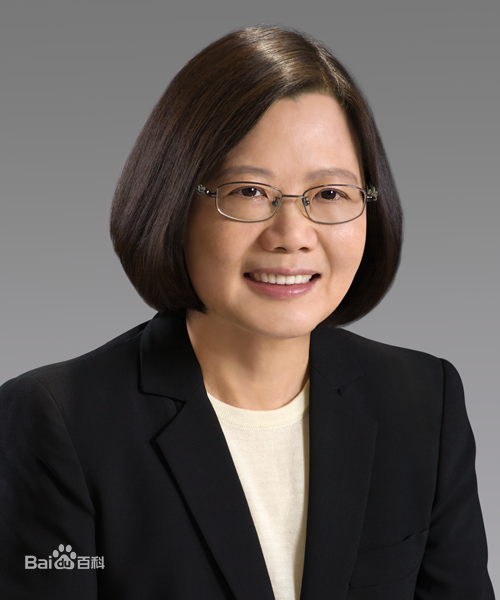

蔡英文（1956年8月31日－），女，中国台湾省屏东县枋山乡枫港人，汉族客家人，台湾学者及政治人物，毕业于台湾大学、康奈尔大学和伦敦大学。现任台湾地区领导人、台“中华文化总会”会长。
2000年民主进步党“执政”后出任台湾当局大陆事务主管部门负责人，2004年加入民主进步党 ，2016年5月20日，蔡英文正式就任台湾地区领导人，成为台湾地区首位女性领导人 ，也是台湾主要政党中第一位女性党主席
2018年11月24日晚间，蔡英文宣布辞去民进党党主席职务。

20世纪90年代，蔡英文在李登辉执政时期曾参与所谓“特殊两国论”的起草 ，2000年民主进步党“执政”后出任台湾当局大陆事务主管部门主任委员。蔡英文原为无党籍人士，后于2004年加入民主进步党，同年当选成为“全台湾”不分区“立法委员”。
