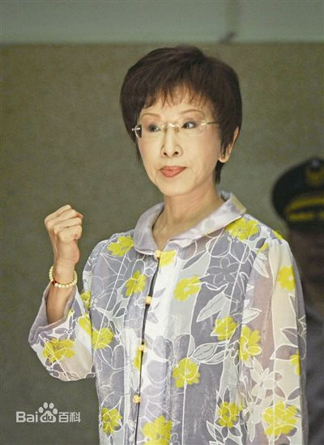

洪秀柱（1948年4月7日—），女，汉族，出生于中国台湾台北县（今新北市），祖籍浙江省余姚市（原属余姚，现属慈溪）。先后毕业于台湾“中国文化大学”法律系，美国东北密苏里州立大学（现杜鲁门州立大学）教育硕士，革命实践研究院第29期结业。中国国民党籍政治家、中国国民党党前主席。洪秀柱是国民党内反对台独，推动两岸交流的代表性人物之一。
2012年，洪秀柱当选中国国民党副主席。  2014年12月3日，国民党中常会推举洪秀柱代理党秘书长。 2015年7月19日，成为2016年台湾地区领导人选举国民党籍候选人，后经“换柱案”，被朱立伦接替。 2016年1月，朱立伦败选台湾地区领导人并辞去党主席，3月26日，洪秀柱当选第13任中国国民党党主席，亦是中国国民党首位女主席，任期至2017年8月。
2019年5月12日至5月15日，中国国民党前主席、中华青雁和平教育基金会董事长洪秀柱将率台湾各界人士代表团一行来北京参访 。
