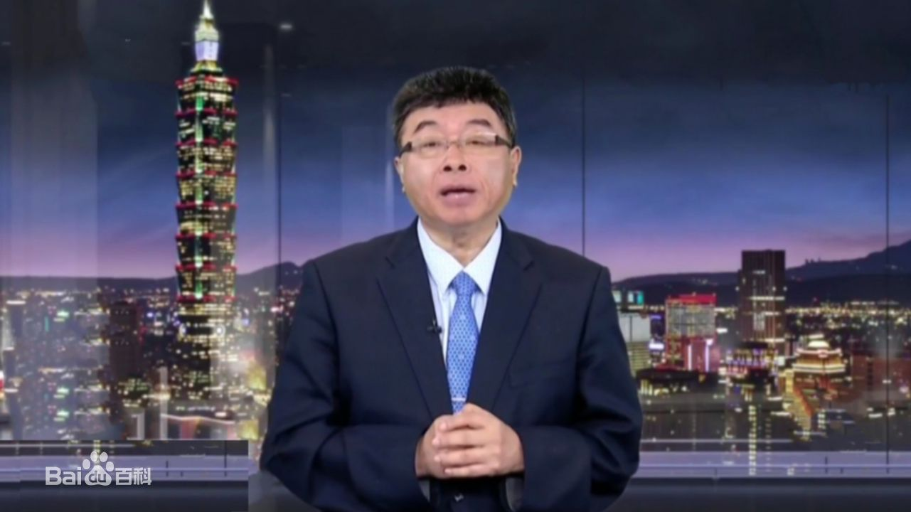

邱毅，1956年5月8日出生于台湾省高雄，台湾地区政治人物，台湾大学经济学博士，中国文化大学国际企业管理研究所教授、上海交通大学策略与危机研究所所长 、台湾义守大学讲座教授。美国康乃尔大学博士后研究。淡江大学大陆研究所教授，台湾中国文化大学财务金融系教授，中华经济研究院研究员，法国巴黎商学院客座教授，澳洲梅铎大学客座教授，吉林大学客座教授  ，华中科技大学武昌分校经济管理学院名誉院长 。曾任中国国民党第十八届第一任中央常务委员，第十九届中央委员。曾加入过亲民党，现有中国国民党和新党双重党籍。 
民进党执政时期，邱毅向媒体揭露了民进党当局高层贪污弊案，因而有“揭弊天王”“爆料天王”的称号，包括陈水扁的夫人收受太平洋崇光百货礼券的丑闻，及陈的女婿赵建铭内线交易丑闻、及最为人知的“总统府副秘书长”陈哲男偕高雄捷运公司副董事长陈敏贤出游韩国济州岛并到赌场赌博照片等，皆由邱毅领先揭发。邱毅爆料的资料通常与民进党弊端有所关连，大宗的丑闻或案件的揭露如SOGO礼券案以及高捷案打到民进党政府的痛处，所以台独支持者常视邱毅为仇寇，而支持的人则视邱毅为揭弊英雄，是个蓝绿看法两极的人物。
